# DeepSeek-V4 DSec 沙箱平台技术研究报告

**文档版本**: 1.0\  
**撰写日期**: 2026-05-07    
**参考来源**: DeepSeek-V4 论文 [本地PDF](refer/DeepSeek_V4.pdf) / [在线访问](https://puiching-memory.github.io/TAAC_2026/papers/deepseek-v4/) / [官方下载链接]([refer/DeepSeek_V4.pdf](https://huggingface.co/deepseek-ai/DeepSeek-V4-Pro/blob/main/DeepSeek_V4.pdf))
  
## 第1章 前言  

DeepSeek Elastic Compute（DSec）是 DeepSeek-V4 论文 [第 5.2.5 节](refer/deepseekv4-5.2.5.md) 披露的生产级沙箱基础设施，专为支撑大规模智能体 AI（Agentic AI）的后训练与评估场景设计。DSec 在单个集群中管理数十万个并发沙箱实例的同时，实现毫秒级启动、虚拟机级安全隔离、以及与 GPU 训练调度无缝集成的抢占恢复能力。

**核心设计指标**：

| 指标 | 数值 | 说明 |
|------|------|------|
| 集群规模 | 数十万并发沙箱 | 单集群支持 |
| 启动延迟 | 毫秒级（快照恢复） | Function Call / microVM |
| 存储底座 | 3FS 分布式文件系统 | 聚合吞吐 6.6 TiB/s |
| 执行底座 | 四种异构环境 | 统一 Python SDK 抽象 |
| 隔离等级 | 进程级至完全虚拟化 | 按需选择 |
| 恢复机制 | 轨迹日志 + 快照 | 防抢占的确定性重放 |

**性能评测表现**：

基于 DeepSeek-V4 论文评测结果，DSec 支撑的 Agent 任务性能优异：

| 基准测试 | 性能 | 说明 |
|---------|------|------|
| Terminal Bench 2.0 | 67.9 | 代码代理能力 |
| SWE Verified | 80.6 | 软件工程任务 |
| BrowseComp | 83.4 | 搜索代理能力 |
| Toolathlon / MCPAtlas | 73.6 | 工具泛化能力 |

DeepSeek-V4 在 MCPAtlas 和 Toolathlon 上表现突出，展现了优秀的工具泛化能力，能够泛化到广泛的工具集和 API，多样化的 MCP 服务以及内部框架之外的外部系统。

**与强化学习框架的深度集成**：

DSec 与 DeepSeek-V4 的强化学习（RL）训练框架深度协同，支撑百万 Token 上下文的强化学习训练：

- **抢占安全恢复**：GPU 任务中断时，沙箱资源保留而非销毁；恢复时重放缓存结果，加速训练恢复
- **容错性**：沙箱故障不影响训练进程，自动迁移到健康节点
- **确定性重放**：使用一致的伪随机数种子确保推理栈的确定性
- **百万 Token 支持**：通过数据格式优化（轻量级元数据 + 重型 per-token 字段分离）和共享内存加载，消除节点内数据冗余

**典型应用场景性能**：

| 场景 | DSec 基座 | 性能指标 |
|------|----------|---------|
| 代码验证（单次调用） | Function Call | < 10ms |
| 完整项目构建测试 | Container | 1-30s |
| 不可信代码执行 | microVM | 100-500ms |
| 复杂 Agent 多轮交互 | Container/microVM | 取决于任务复杂度 |

本报告基于论文原文及 DeepSeek 技术团队公开资料，对 DSec 的架构设计、安全机制、实现细节进行系统性梳理，旨在为研发团队提供可落地实施的技术参考。

---

## 2. DSec 设计背景与动机

### 2.1 智能体 AI 的执行挑战

DSec 的设计源于对智能体 AI 后训练与评估场景的四个关键观察：

**观察一：工作负载的高度异构性**

智能体 AI 的执行需求跨越多个数量级：从单行 Python 代码验证（毫秒级、零状态）到完整的软件工程流水线（分钟级、需要完整 OS 环境）。不同任务对操作系统、安全策略、资源需求的要求截然不同，通用容器平台难以高效覆盖。

**观察二：镜像的规模与加载速度矛盾**

环境镜像数量庞大（数百个差异化镜像），体积巨大（数 GB），但沙箱必须能够快速加载以满足实时推理需求。传统镜像下载/解压模式无法接受。

**观察三：高密度部署的资源效率**

数十万沙箱实例需要高效利用 CPU 和内存资源。虚拟化开销、页缓存重复占用、锁竞争等问题在高密度场景下会被显著放大。

**观察四：沙箱生命周期与训练调度的协同**

沙箱不能独立于 GPU 训练调度器运行。当 GPU 任务被抢占时，沙箱状态必须能够被保留、迁移和恢复，否则将导致长时间任务的失败和资源浪费。

### 2.2 设计目标

基于上述观察，DSec 确立了三项核心设计目标：

| 目标   | 含义                        |
| ---- | ------------------------- |
| 统一抽象 | 对上层暴露单一 SDK，屏蔽底层异构执行环境的差异 |
| 极致性能 | 毫秒级启动、3FS 级吞吐、内存超卖能力      |
| 训练感知 | 抢占安全的轨迹日志、快照恢复、与训练框架原生集成  |

***

## 3. 系统架构

### 3.1 组件架构总览

DSec 由三个 Rust 核心组件构成，通过自定义 RPC 协议互联，构建于 3FS 分布式文件系统之上：

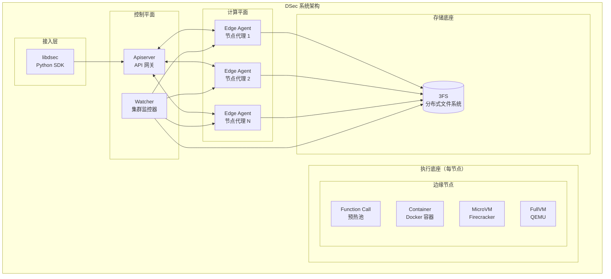

### 3.2 核心组件详解
注：以下组件的职责、暴露 API、核心参数等，均基于 DeepSeek-V4 论文描述推断，仅供参考。
#### 3.2.1 libdsec（Python SDK）

**职责**：为上层智能体提供统一的 Python 接口，抽象四种执行底座的差异。

**暴露 API**：

| API               | 功能      |
| ----------------- | ------- |
| `command_exec()`  | 执行命令    |
| `file_transfer()` | 文件传输    |
| `tty_access()`    | 交互式终端访问 |

**核心参数**：

```python
result = client.command_exec(
    command="python train.py",
    substrate="container",  # function_call | container | microvm | fullvm
    sandbox_id="sandbox-xxx"
)
```

切换执行底座仅需修改 `substrate` 参数，所有其他代码保持不变。

#### 3.2.2 Apiserver（API 网关）

**职责**：

- 认证与授权
- 请求路由与负载均衡
- 沙箱生命周期管理
- 轨迹日志入口

**部署模式**：无状态设计，水平扩展

**核心数据结构**：

```python
# 每个沙箱实例的元数据
sandbox_meta = {
    "sandbox_id": "uuid",
    "substrate": "container",
    "node_id": "edge-host-01",
    "created_at": "timestamp",
    "status": "running",  # init | running | paused | destroyed
    "image": "deepseek/python:3.11"
}
```

#### 3.2.3 Edge Agent（节点代理）

**职责**：

- 部署在每台物理计算节点
- 接收 Apiserver 指令
- 管理本机沙箱进程的生命周期
- 资源监控与上报
- 执行抢占操作
- 快照写入

**关键能力**：

| 能力   | 实现                        |
| ---- | ------------------------- |
| 资源监控 | CPU/内存/IO 指标采集，上报 Watcher |
| 抢占执行 | 冻结沙箱进程，导出状态               |
| 内存回收 | MADVISE/KSM 合并重复页，支持内存超卖  |

#### 3.2.4 Watcher（集群监控器）

**职责**：

- 集群级健康监控
- 故障检测与自动迁移
- 告警触发

**心跳机制**：

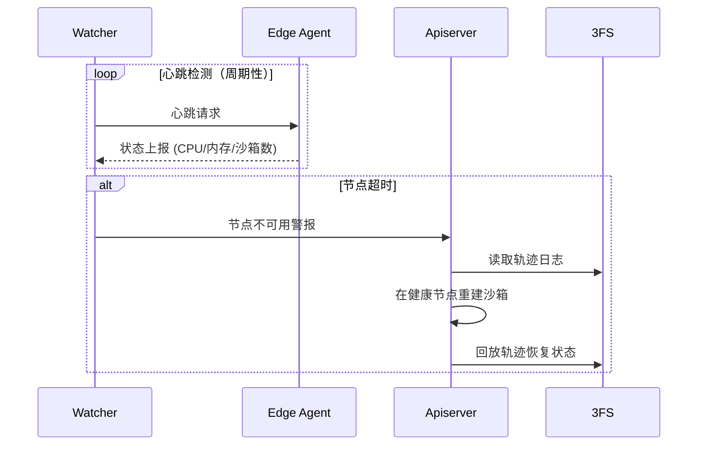

### 3.3 组件交互流程

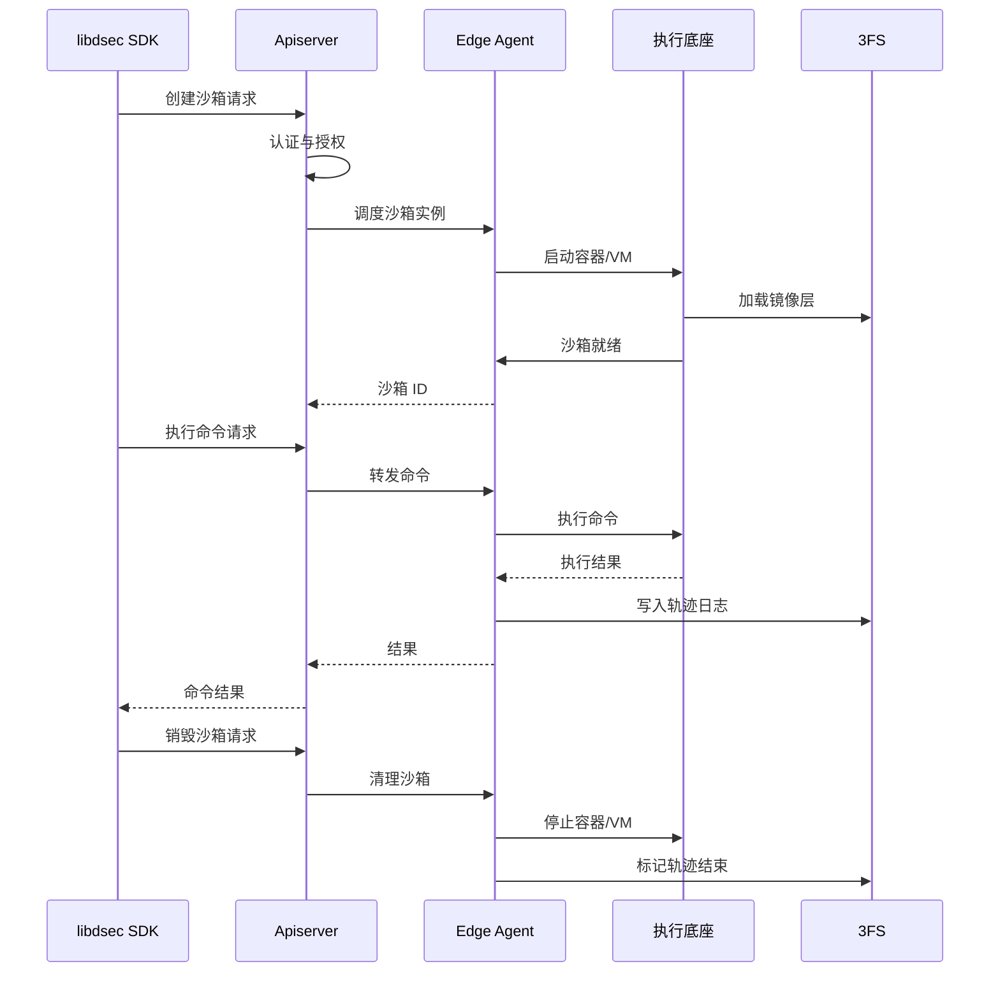

***

## 4. 四种执行底座详解

DSec 抽象了四种执行底座，在隔离性、启动速度、资源密度、生态兼容性四个维度上提供不同权衡点。所有底座共享统一 API，切换成本极低。

### 4.1 基座对比总览

| 维度         | Function Call | Container    | microVM              | fullVM             |
| ---------- | ------------- | ------------ | -------------------- | ------------------ |
| **隔离级别**   | 进程级           | 内核命名空间       | 虚拟机级（独立内核）           | 完全虚拟化              |
| **安全性**    | 低             | 中（容器逃逸风险）    | 高（硬件隔离）              | 最高                 |
| **启动速度**   | 毫秒级           | 秒级           | 秒级（快照可至百毫秒）          | 秒至分钟级              |
| **资源开销**   | 极低            | 低            | 中                    | 高                  |
| **单机部署密度** | 万级            | 千级           | 千级                   | 百级                 |
| **镜像兼容性**  | 无需镜像          | 标准 Docker 镜像 | Docker 镜像（overlaybd） | 任意 OS 安装镜像         |
| **快照与恢复**  | 不支持           | 有限支持         | 链式快照，毫秒级恢复           | 磁盘快照               |
| **典型场景**   | 规则验证、API 调用   | 代码执行、数据分析    | 不可信代码、网络操作           | OS 内核开发、非 Linux OS |

### 4.2 基座选择决策树

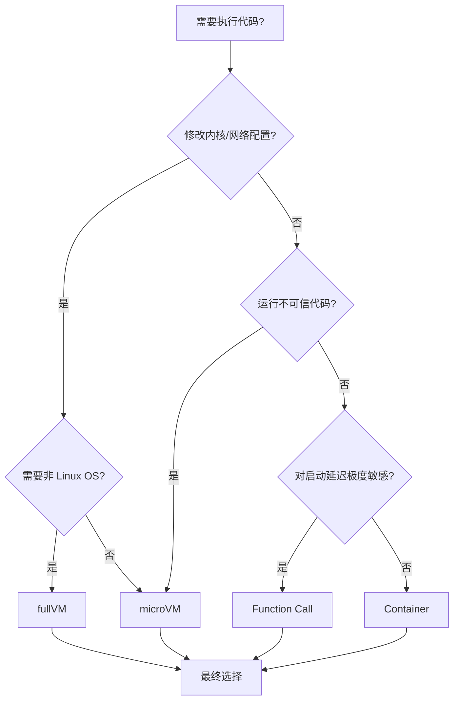

### 4.3 Function Call（函数调用）

**定位**：最高频、最轻量的无状态执行单元，适用于 QPS 极高的验证类工作负载。

**架构原理**：

不启动任何独立容器或虚拟机。Apiserver 维护一个预热的容器/进程池，请求到达时直接从池中分配一个空闲执行器，省去所有启动开销。

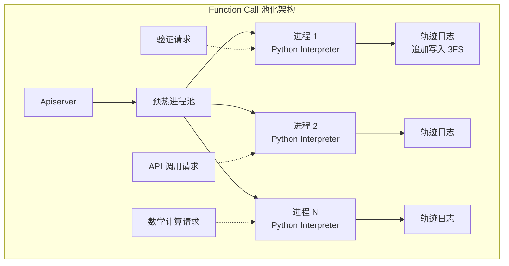

**关键约束**：

| 约束   | 说明                    |
| ---- | --------------------- |
| 无状态  | 调用结束后不保留任何文件系统状态      |
| 低延迟  | 适用于毫秒级响应需求的验证类工作负载    |
| 安全边界 | 仅依赖语言运行时沙箱，不提供 OS 级隔离 |
| 幂等性  | 依赖轨迹日志防止非幂等操作重复执行     |

**适用场景**：

- 数学公式/表达式求值
- API 调用与第三方服务集成测试
- 代码片段的语法验证
- 规则引擎执行

### 4.4 Container（容器）

**定位**：生态兼容性最好的标准化执行环境，是大多数研发任务的默认选择。

**技术栈**：

- 容器运行时：Docker 兼容
- 镜像格式：标准 OCI 镜像
- 只读文件系统：EROFS（Enhanced Read-Only File System）
- 可写层：OverlayFS

#### 4.4.1 EROFS 详解

EROFS 是华为提出并合入 Linux 主线的只读文件系统，专为容器镜像场景优化：

| 特性       | 说明                                   |
| -------- | ------------------------------------ |
| 元数据与数据分离 | 挂载时仅缓存文件目录结构（极小），实际数据块在读取时从 3FS 按需拉取 |
| 启动加速     | 一个 2GB 镜像即使只用到 100KB 文件，也无需等待全量下载    |
| 跨实例共享    | 基础镜像层以文件级粒度共享，任何实例只需加载其实际使用的块        |

**原理示意**：

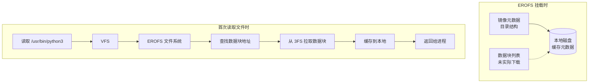

#### 4.4.2 OverlayFS 写时复制机制

OverlayFS 将容器文件系统分为两层：

| 层        | 挂载参数 | 特性                           |
| -------- | ---- | ---------------------------- |
| lowerdir | 下层   | 指向 EROFS 挂载点，只读，承载基础镜像       |
| upperdir | 上层   | 指向本地磁盘，承载所有修改（Copy-on-Write） |
| merged   | 合并视图 | 进程看到的一致视图                    |

**读写路径**：

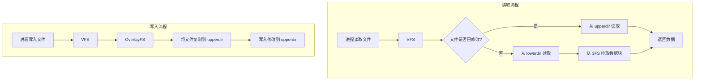

**关键优势**：

- 下层（EROFS）保持不变，支持镜像复用
- 上层（本地磁盘）承载所有修改，隔离污染
- 文件级粒度的 CoW，开销远小于整盘复制

#### 4.4.3 镜像生命周期

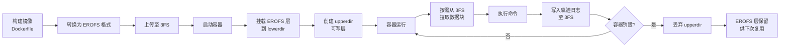

### 4.5 microVM（微虚拟机）

**定位**：专为不可信代码和高安全需求场景设计，提供虚拟机级别的硬件隔离。

**技术选型**：基于 AWS Firecracker VMM

#### 4.5.1 Firecracker 核心特性

| 特性     | 说明                                        |
| ------ | ----------------------------------------- |
| 极简设备模型 | 仅保留运行 Linux 所必需的 virtio 设备（网络、块设备、熵源、控制台） |
| 代码量极小  | 相比 QEMU 减少两个数量级，攻击面大幅缩小                   |
| 启动速度   | 从数秒降至数十毫秒                                 |
| 内存开销   | 仅需 \~5MB 内存开销（MB 使用 KVM）                  |

#### 4.5.2 overlaybd 磁盘格式

microVM 无法直接使用 OverlayFS（因为虚拟机有独立内核，无法访问宿主机文件系统），因此使用 overlaybd 用户态块设备：

| 层       | 存储位置        | 特性                    |
| ------- | ----------- | --------------------- |
| 基础只读层   | 3FS（跨实例共享）  | 所有同类型 VM 实例共享同一只读基础镜像 |
| CoW 写入层 | 本地 NVMe SSD | 每个 VM 实例独享，记录所有写操作    |

**数据读写路径**：

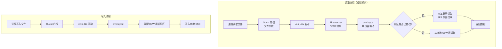

#### 4.5.3 为什么 Container 不够用？

| 攻击场景    | Container 风险    | microVM 防护         |
| ------- | --------------- | ------------------ |
| 容器逃逸漏洞  | 内核命名空间隔离可能被绕过   | 独立内核，完全硬件虚拟化隔离     |
| 特权容器    | 可直接访问宿主机设备      | 虚拟机内部无特权，宿主资源不可达   |
| 内核级恶意代码 | 可修改宿主机内核参数      | 恶意代码限制在 VM 内核中     |
| 横向移动    | 容器间共享内核，可利用内核漏洞 | 每个 VM 有独立内核，无法横向利用 |

#### 4.5.4 链式快照机制

overlaybd 支持链式快照，允许从任意快照点毫秒级恢复：

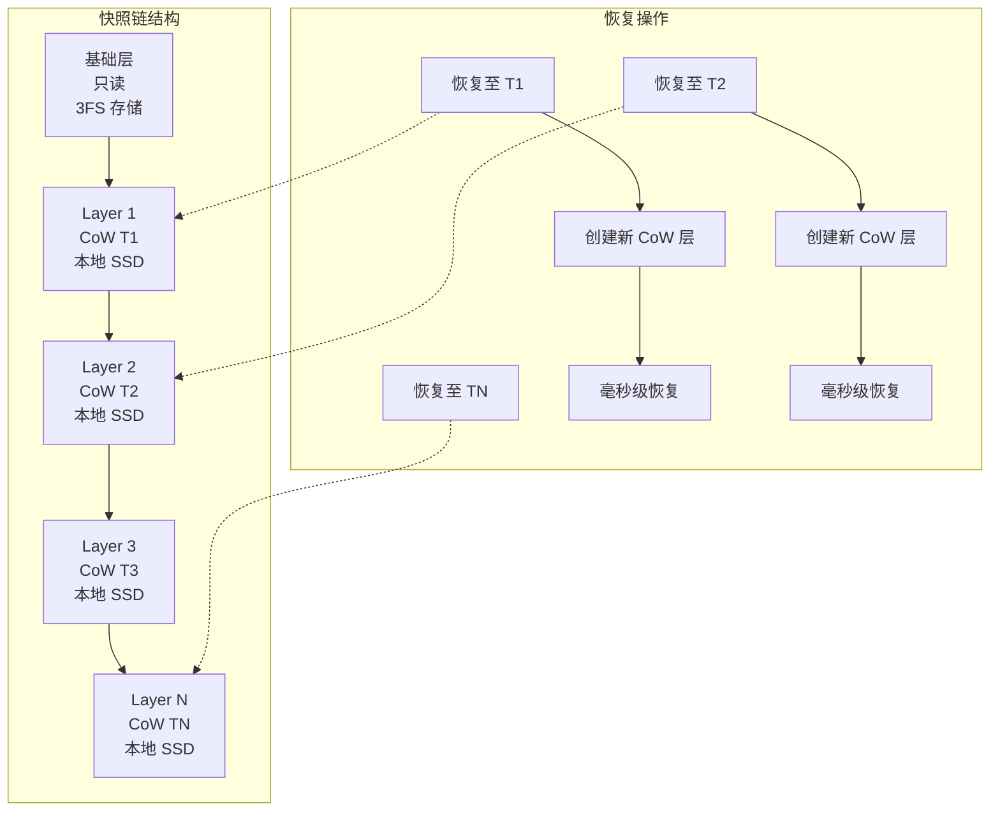

**恢复原理**：不需要复制任何数据，仅需创建新的 CoW 层并重新建立指针关系，恢复时间与数据量无关。

**典型安全场景**：

- 执行 AI 生成的恶意探测代码（`rm -rf /`、`fork` 炸弹）
- 需要 root 权限或修改 iptables、sysctl 等内核参数的测试
- 多租户环境下的代码执行
- Docker-in-Docker 场景

### 4.6 fullVM（全虚拟机）

**定位**：操作系统级兼容性的终极方案，支持任意 Guest OS。

**技术选型**：基于 QEMU 全功能虚拟机

| 特性      | 说明                                   |
| ------- | ------------------------------------ |
| OS 支持   | 支持 Windows、macOS、FreeBSD 等非 Linux 系统 |
| 硬件平台    | 可模拟 x86\_64 / ARM64 完整硬件平台           |
| 设备模拟    | 多种磁盘控制器、网卡、GPU 模拟能力                  |
| GPU 虚拟化 | 支持 vGPU、GPU 直通等高级功能                  |

**与 microVM 的选择边界**：

| 场景             | 选择              | 原因               |
| -------------- | --------------- | ---------------- |
| 仅需运行 Linux 二进制 | Container       | 启动最快、资源开销最小      |
| 需 Linux 内核级隔离  | microVM         | Firecracker 即可满足 |
| 需要非 Linux 操作系统 | **必须选择 fullVM** | QEMU 是唯一选择       |
| 需要 GPU 虚拟化     | fullVM          | 支持 vGPU 等高级特性    |
| 需要图形桌面交互       | fullVM          | 支持完整显示设备模拟       |

***

## 5. 核心安全机制

### 5.1 多层隔离策略

DSec 采用**纵深防御**理念，在不同层级提供隔离保障：

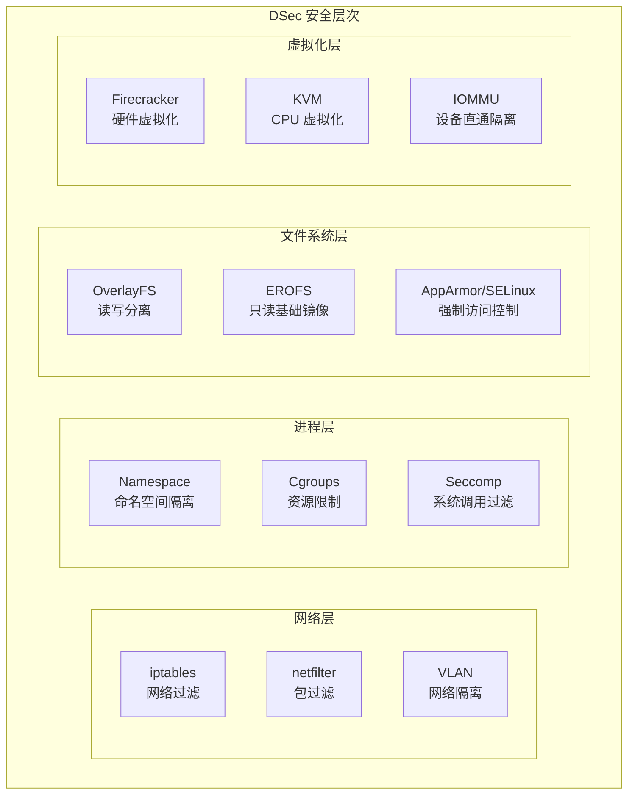

### 5.2 各基座安全边界定义

#### 5.2.1 Function Call 安全边界

| 边界   | 说明                       |
| ---- | ------------------------ |
| 进程隔离 | 依赖语言运行时沙箱（Python/JS 解释器） |
| 资源限制 | Cgroups 限制 CPU/内存/时间     |
| 网络隔离 | 沙箱进程无网络访问能力              |
| 文件系统 | 临时内存文件系统，调用结束即销毁         |

**安全假设**：Function Call 仅适用于可信代码。恶意代码可能利用解释器漏洞突破沙箱。

#### 5.2.2 Container 安全边界

| 边界                | 说明                                    |
| ----------------- | ------------------------------------- |
| 内核命名空间            | PID/Network/Mount/UTS/IPC/User 命名空间隔离 |
| Cgroups           | CPU/内存/IO 资源硬限制                       |
| Capabilities      | 移除所有特权能力（CAP\_SYS\_ADMIN 等）           |
| Seccomp           | 过滤危险系统调用（ptrace、mount 等）              |
| AppArmor/SELinux  | 强制访问控制策略                              |
| No New Privileges | 禁止提升特权                                |

**已知风险**：

| 攻击向量   | 风险等级 | 缓解措施              |
| ------ | ---- | ----------------- |
| 容器逃逸   | 中    | 定期内核补丁、seccomp 过滤 |
| 内核漏洞利用 | 中    | 内核版本管理、安全更新       |
| 资源耗尽   | 低    | Cgroups 硬限制       |
| 共享内核攻击 | 中    | 不可信代码使用 microVM   |

#### 5.2.3 microVM 安全边界

| 边界        | 说明                           |
| --------- | ---------------------------- |
| 硬件虚拟化     | KVM 提供 CPU/内存完全隔离            |
| 独立内核      | 每个 VM 运行独立 Linux 内核          |
| 虚拟化 IOMMU | 设备直通时 DMA 隔离                 |
| 最简设备模型    | Firecracker 仅暴露 virtio，风险面极小 |
| 安全启动      | 可配置 UEFI 安全启动链               |

**安全优势**：

- 内核漏洞无法横向传播到宿主机或其他 VM
- 恶意代码的权限被锁定在 VM 内核空间
- 攻击面相比 QEMU 减少两个数量级

#### 5.2.4 fullVM 安全边界

| 边界        | 说明                 |
| --------- | ------------------ |
| 完全虚拟化     | QEMU 模拟完整硬件环境      |
| BIOS/UEFI | 完整固件栈              |
| 任意 OS 支持  | 可运行任何兼容架构的操作系统     |
| 物理设备隔离    | 可通过 IOMMU 实现设备直通隔离 |

**适用场景**：当 microVM 的 Linux 内核级隔离仍不满足需求时（如需要模拟非 Linux 环境）。

### 5.3 密度优化技术详解 

DSec 为支持每个集群数十万个沙箱实例，采用了三项核心优化技术：

#### 5.3.1 页缓存去重技术

**问题背景**：在虚拟化环境中，多个沙箱实例运行相同的基础镜像或系统库时，内核页缓存中会存在大量重复页面，浪费内存资源。

**解决方案：KSM（Kernel Samepage Merging）**

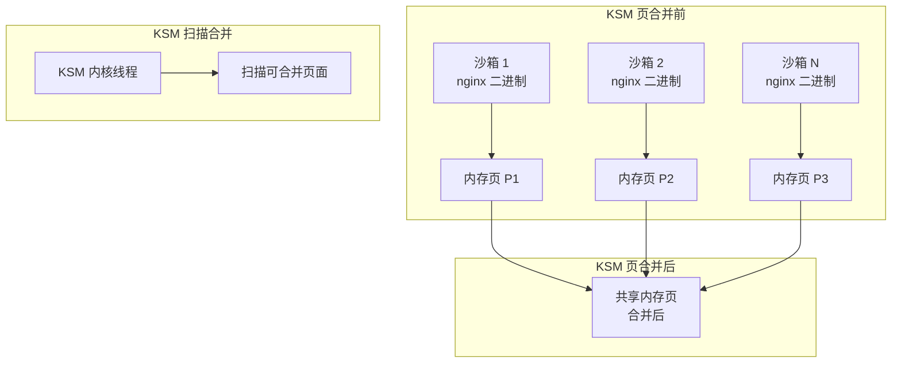

**实现机制**：

| 参数 | 说明 |
|------|------|
| `ksm.deferred_timer` | 延迟合并，减少 CPU 开销 |
| `ksm.sleep_millisecs` | 扫描间隔控制 |
| `ksm.pages_to_scan` | 每次扫描页面数 |
| 内存去重率 | 相同镜像场景下可节省 30-60% 内存 |

**配置示例**：

```bash
# 启用 KSM
echo 1 > /sys/kernel/mm/ksm/run

# 设置扫描参数
echo 100 > /sys/kernel/mm/ksm/pages_to_scan
echo 200 > /sys/kernel/mm/ksm/sleep_millisecs
```

#### 5.3.2 内存超卖与安全回收

**问题背景**：数十万沙箱的总内存需求远超物理内存，需要安全地实现内存超卖。

**解决方案：内存回收策略 + cgroup 硬限制**

| 技术 | 作用 |
|------|------|
| ZRAM | 内存压缩，将冷数据压缩存储 |
| swap | 将不活跃页面换出到磁盘 |
| OOM Killer | 内存耗尽时的最后保护 |
| cgroup 硬限制 | 防止单个沙箱耗尽系统内存 |

**安全超卖策略**：

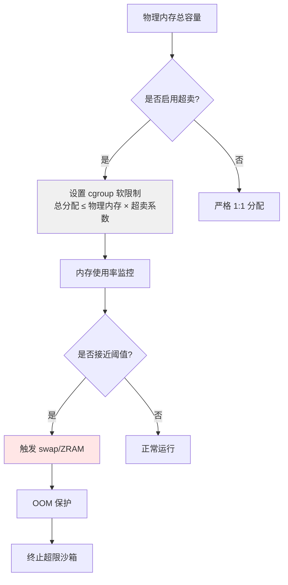

**超卖系数建议**：

| 场景 | 超卖系数 | 说明 |
|------|----------|------|
| 内存密集型 | 1.0 | 无超卖，保证性能 |
| 通用场景 | 1.2-1.5 | 平衡资源利用和稳定性 |
| 开发测试 | 2.0-3.0 | 最大化资源利用 |

#### 5.3.3 自旋锁争用优化

**问题背景**：高密度部署时，容器运行时的锁竞争会成为 CPU 开销瓶颈。

**优化策略**：

| 优化点 | 技术方案 | 效果 |
|--------|----------|------|
| 运行时锁优化 | 减少锁粒度、使用无锁数据结构 | 降低锁竞争 |
| CPU 亲和性 | 固定沙箱到特定 CPU 核心 | 减少缓存失效 |
| 批处理优化 | 批量处理请求，减少上下文切换 | 提高吞吐量 |

**per-host 打包密度提升**：

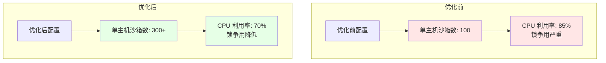

**关键指标**：

| 指标 | 优化前 | 优化后 | 提升 |
|------|--------|--------|------|
| 单主机沙箱密度 | ~100 | 300+ | **3×** |
| CPU 锁争用 | 高 | 低 | **显著下降** |
| 内存利用率 | ~60% | ~80% | **+20%** |

### 5.4 资源隔离机制

#### 5.4.1 Cgroups 资源控制

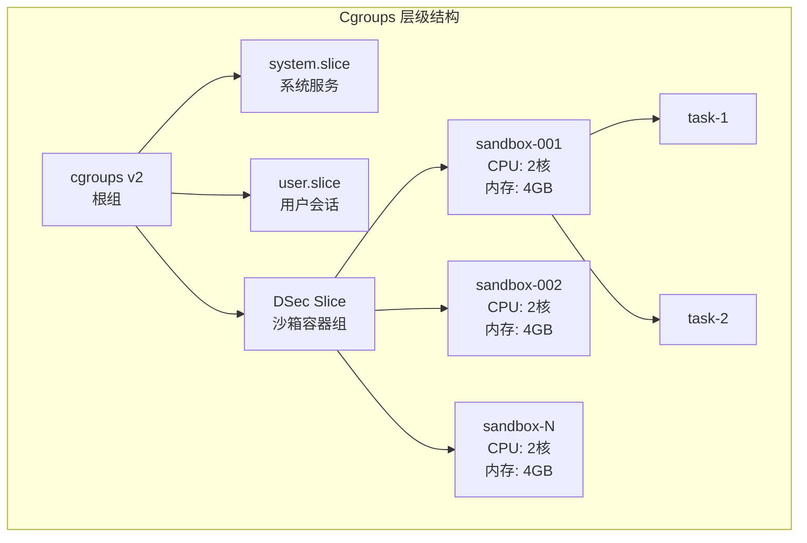

| 资源   | 控制参数                            | 说明                |
| ---- | ------------------------------- | ----------------- |
| CPU  | `cpu.max`, `cpuset.cpus`        | CPU 份额与亲和性        |
| 内存   | `memory.max`, `memory.swap.max` | 内存上限与 swap 限制     |
| IO   | `io.max`, `io.bfq.weight`       | 磁盘 IOPS/带宽限制      |
| PIDs | `pids.max`                      | 进程数上限（防止 fork 炸弹） |

#### 5.4.2 网络隔离

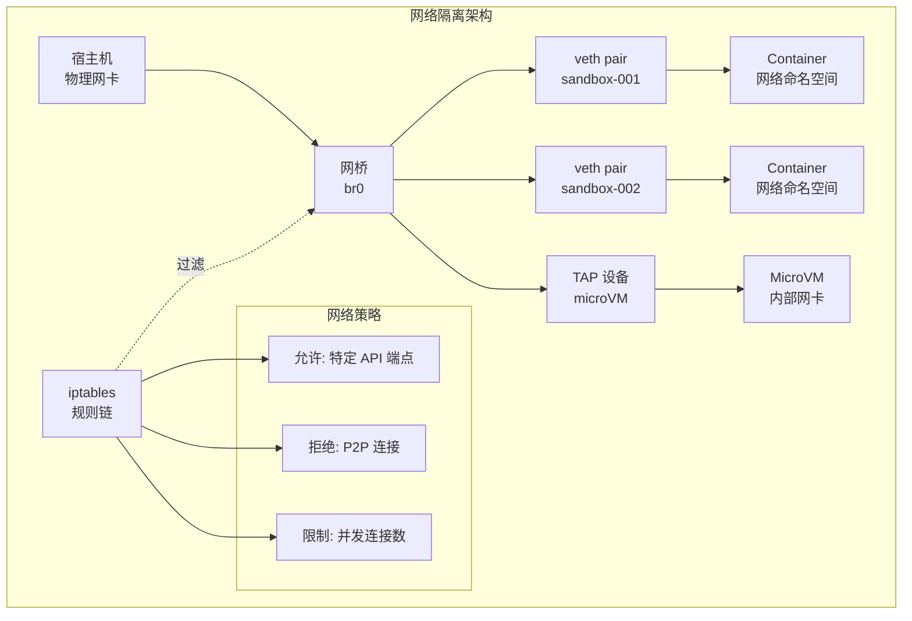

**网络策略示例**：

```bash
# 仅允许访问特定白名单域名
iptables -A OUTPUT -d 10.0.0.0/8 -j ACCEPT
iptables -A OUTPUT -d 0.0.0.0/0 -j REJECT

# 限制并发连接数
iptables -A OUTPUT -p tcp --syn -m connlimit --connlimit-above 100 -j REJECT
```

***

## 6. 存储架构与 3FS 集成

### 6.1 3FS 在 DSec 中的角色

3FS 是 DSec 的**核心存储底座**，所有持久化数据均存储在 3FS 上：

| DSec 组件   | 3FS 用途                  |
| --------- | ----------------------- |
| Container | EROFS 镜像层存储，按需拉取数据块     |
| microVM   | overlaybd 基础只读层，跨所有实例共享 |
| fullVM    | QEMU 虚拟磁盘镜像，启动时按需加载     |
| 轨迹日志      | 每个沙箱的命令和结果追加写入，用于恢复     |
| 快照存储      | microVM 链式快照存储          |

### 6.2 3FS 架构概览

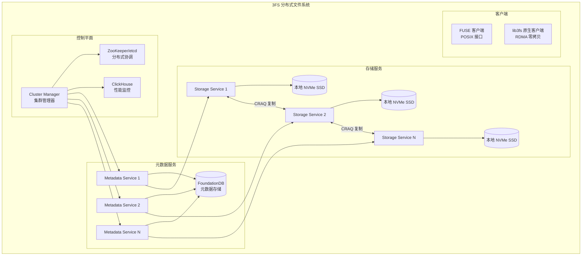

### 6.3 3FS 核心性能指标

| 指标       | 数值                | 说明         |
| -------- | ----------------- | ---------- |
| 集群聚合读取吞吐 | **6.6 TiB/s**     | 180 节点集群   |
| 单客户端峰值吞吐 | **> 40 GiB/s**    | KVCache 场景 |
| 一致性模型    | **强一致性**          | CRAQ 链式复制  |
| 网络层      | InfiniBand / RoCE | RDMA 高速互联  |

### 6.4 设计灵感来源

3FS 并非理论驱动的研究原型，而是**需求驱动、博采众长**的工程产物：

| 灵感来源 | 借鉴点 | 3FS 融合方式 |
|----------|--------|--------------|
| VAST Data / WekaFS / DAOS | 端到端无缓存理念 | 将这一理念贯穿到数据和元数据两条路径 |
| CephFS / JuiceFS | 元数据与数据分离架构 | 继承该架构的独立可扩展性优势 |
| Microsoft Azure / Meta Delta | 链式复制协议 (CRAQ) | 用于保障数据强一致性的同时维持高吞吐 |
| Google Colossus | 极简元数据，大块存储的设计思想 | 强化了专注 AI 大文件场景的决心 |
| 幻方 AI（DeepSeek 前身） | 自研高速文件系统的早期积累 | 从 2019 年起孵化，业务需求驱动迭代 |

**核心技术理念**：

> **在 RDMA 和全闪存时代，最好的缓存就是没有缓存，最好的锁就是没有锁**

### 6.5 POSIX 兼容与用户视角

3FS 提供两种接入方式，兼顾易用性和极致性能：

| 接入方式 | 接口类型 | 性能特征 | 适用场景 |
|----------|----------|----------|----------|
| FUSE 客户端 | 标准 POSIX 文件接口 | 良好（经内核协议栈优化） | 普通 AI 训练、数据加载、DSec 沙箱镜像挂载 |
| 原生客户端 lib3fs | 用户态 API | 极致（零拷贝 RDMA） | GPU KVCache，高速 Checkpoint，DSec 底层存储引擎 |

**FUSE 挂载示例**：

```bash
# 挂载后即成为本地文件系统的一部分
mount -t fuse3fs <cluster-config> /mnt/3fs
```

```python
# 完全无感知，标准库直接读取
with open('/mnt/3fs/datasets/imagenet/train-00000.tar', 'rb') as f:
    data = f.read()

# 与 PyTorch 生态无缝集成
import torchvision
dataset = torchvision.datasets.ImageFolder(root='/mnt/3fs/datasets/imagenet')
```

**设计取舍**：

| 传统问题 | 3FS 解决方案 |
|----------|--------------|
| 文件锁、并发写入冲突 | AI 工作负载（一次写入、多次读取），无需 POSIX 锁语义 |
| 多层缓存维护开销 | 无缓存设计，数据路径极简 |
| 复杂并发控制 | 无锁设计，依赖 CRAQ 强一致复制协议 |

### 6.6 零拷贝 RDMA 技术原理

3FS 实现极致性能的核心在于**绕过内核的零拷贝 RDMA**：

**传统 I/O 路径瓶颈**：


| 问题     | 影响                        |
| ------ | ------------------------- |
| 上下文切换  | 至少 4 次用户态/内核态切换           |
| 内存拷贝   | 2 次 CPU 主导的数据搬运           |
| CPU 瓶颈 | 100Gbps+ 网络时 CPU 无法"榨干"硬件 |

**3FS 解决路径**：

1. **绕过内核（Kernel Bypass）**：将网卡控制寄存器、发送/接收队列直接映射到用户进程内存空间
2. **零拷贝 RDMA**：存储节点网卡直接从本地 SSD 缓冲区提取数据，发送到目标节点网卡，CPU 仅在传输前后做控制层面的"安排"

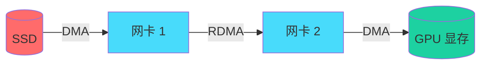

***

## 7. 轨迹日志与抢占恢复机制

这是 DSec 最核心的训练感知设计。

### 7.1 轨迹日志设计

DSec 为每个沙箱维护一个**全局有序的轨迹日志**，持久化记录每一个命令调用及其结果：

**日志格式**：

```python
# 轨迹日志条目
trajectory_entry = {
    "sandbox_id": "uuid",
    "seq_no": 1,                    # 命令序列号
    "timestamp": "2026-05-07T10:00:00Z",
    "command": "python train.py --config config.yaml",
    "result_hash": "sha256:abc123...",  # 结果哈希
    "status": "success",             # success | failed | timeout
    "idempotent": False,            # 是否幂等
    "metadata": {
        "exit_code": 0,
        "duration_ms": 5000,
        "stdout_size": 1024,
        "stderr_size": 0
    }
}
```

**存储方式**：直接使用 3FS 的追加写能力，无需额外数据库。

### 7.2 轨迹日志三大用途

#### 7.2.1 客户端快进（Client Fast-Forward）

当 GPU 训练任务被抢占时，沙箱资源被保留而非销毁。恢复时，DSec 重放之前已完成命令的缓存结果：

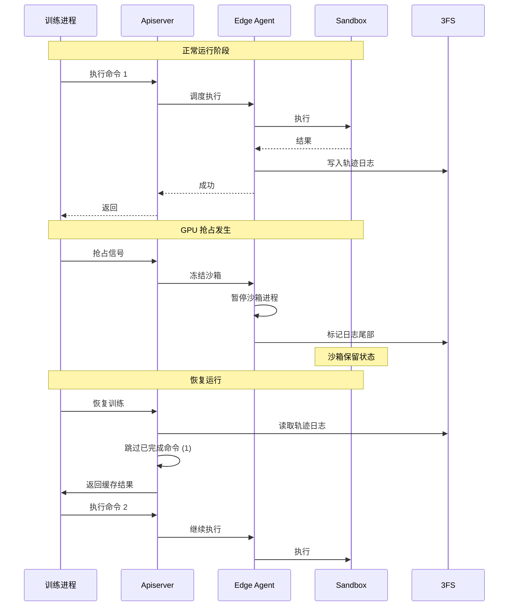

**关键优势**：

- 加速任务恢复：无需重新执行已完成命令
- 防止非幂等操作重复执行：轨迹日志记录幂等性标识
- 减少 GPU 空转时间：抢占恢复延迟降至秒级

#### 7.2.2 细粒度溯源（Fine-Grained Provenance）

轨迹日志记录每个状态变更的来源和结果，支持：

- 审计追踪：谁在什么时间执行了什么操作
- 调试复现：任何时间点的状态可精确还原
- 增量分析：每个命令的影响可独立评估

#### 7.2.3 确定性重放（Deterministic Replay）

任何历史会话都可以从其轨迹中被忠实地复现：

```mermaid
graph TB
    A[历史轨迹日志] --> B[解析命令序列]
    B --> C{幂等性判断}
    C -->|幂等| D[直接重放命令]
    C -->|非幂等| E[使用缓存结果]
    D --> F[验证结果一致性]
    E --> F
    F --> G[状态一致性验证]
```

### 7.3 快照与恢复流程

```mermaid
graph TB
    subgraph "抢占时的快照导出"
        E1[Edge Agent] --> O[导出 overlaybd CoW 层]
        O --> I[生成新镜像层]
        I --> L[记录日志序列号]
        L --> FS[(3FS<br/>快照存储)]
    end
    
    subgraph "恢复时的状态重建"
        L2[日志序列号] --> R[从快照创建新沙箱]
        R --> C[读取已完成命令]
        C --> H[注入结果缓存]
        H --> SK[识别非幂等操作]
        SK --> NC[跳过非幂等操作]
        NC --> CONTINUE[从日志尾部继续执行]
    end
```

**恢复流程详解**：

1. **快照创建**：从 overlaybd 的 CoW 层导出当前状态，生成新的可恢复镜像
2. **日志回放**：从 3FS 读取轨迹日志，定位最后完成的命令序列号
3. **结果注入**：对已完成命令，读取其 result\_hash，直接注入结果缓存
4. **非幂等处理**：识别 idempotent=False 的命令，跳过重放
5. **继续执行**：从日志尾部继续处理新命令

***

## 8. 威胁建模分析

### 8.1 攻击面分析

```mermaid
graph TB
    subgraph "DSec 攻击面"
        subgraph "外部攻击面"
            EXT1[API 网关<br/>Apiserver]
            EXT2[Python SDK<br/>libdsec]
            EXT3[网络接口<br/>端口暴露]
        end
        
        subgraph "容器逃逸向量"
            CE1[内核漏洞<br/>命名空间隔离]
            CE2[特权容器<br/>危险 Capabilities]
            CE3[挂载敏感目录<br/>宿主机文件访问]
        end
        
        subgraph "虚拟机攻击向量"
            VM1[Hypervisor 漏洞<br/>QEMU/Firecracker]
            VM2[virtio 驱动漏洞]
            VM3[VM 逃逸]
        end
        
        subgraph "数据安全威胁"
            DS1[轨迹日志泄露<br/>敏感数据]
            DS2[镜像层污染<br/>恶意依赖]
            DS3[快照恢复攻击]
        end
    end
```

### 8.2 威胁场景与缓解措施

#### 威胁场景 1：容器逃逸

| 维度   | 描述                                  |
| ---- | ----------------------------------- |
| 攻击描述 | 恶意代码利用容器内漏洞（如特权容器、内核漏洞）突破隔离，访问宿主机资源 |
| 影响   | 威胁同主机其他沙箱安全，可能导致数据泄露或横向移动           |
| 风险等级 | **高**（对 Container 基座）               |

**缓解措施**：

| 措施                | 实现                              |
| ----------------- | ------------------------------- |
| 移除危险 Capabilities | `--cap-drop=ALL --cap-add=none` |
| Seccomp 过滤        | 仅允许白名单系统调用                      |
| 非特权容器             | 强制使用非特权用户运行                     |
| 不可信代码隔离           | 使用 microVM 基座运行不可信代码            |
| 内核安全更新            | 定期打补丁，关注容器逃逸 CVE                |

#### 威胁场景 2：沙箱资源耗尽

| 维度   | 描述                                |
| ---- | --------------------------------- |
| 攻击描述 | 恶意代码通过 fork 炸弹、内存泄漏、磁盘填充等方式耗尽沙箱资源 |
| 影响   | 沙箱性能下降或崩溃，影响同主机其他沙箱               |
| 风险等级 | **中**                             |

**缓解措施**：

| 措施     | 实现                  |
| ------ | ------------------- |
| PID 限制 | `pids.max` 限制进程数    |
| 内存硬限制  | `memory.max` 强制 OOM |
| CPU 限制 | `cpu.max` 防止 CPU 垄断 |
| IO 限制  | `io.max` 限制磁盘 IOPS  |
| 磁盘配额   | 限制沙箱可写入的数据量         |
| 超时机制   | 命令执行超时自动终止          |

#### 威胁场景 3：轨迹日志数据泄露

| 维度   | 描述                                |
| ---- | --------------------------------- |
| 攻击描述 | 轨迹日志包含命令和结果，可能包含敏感数据（API 密钥、用户信息） |
| 影响   | 敏感数据泄露，违反数据安全合规要求                 |
| 风险等级 | **高**                             |

**缓解措施**：

| 措施     | 实现                 |
| ------ | ------------------ |
| 传输加密   | 所有 RPC 通信使用 TLS 加密 |
| 存储加密   | 3FS 支持静态加密         |
| 访问控制   | 基于角色的轨迹日志访问权限      |
| 数据脱敏   | SDK 层对敏感输出自动脱敏     |
| 生命周期管理 | 训练完成后自动清理日志        |

#### 威胁场景 4：恶意镜像注入

| 维度   | 描述                   |
| ---- | -------------------- |
| 攻击描述 | 恶意代码修改基础镜像，注入后门或恶意依赖 |
| 影响   | 所有使用该镜像的沙箱被污染        |
| 风险等级 | **高**                |

**缓解措施**：

| 措施    | 实现                         |
| ----- | -------------------------- |
| 镜像签名  | 使用 Cosign 等工具对镜像签名验证       |
| 镜像扫描  | CI/CD 流程中集成 Trivy/Clair 扫描 |
| 只读基础层 | EROFS 层强制只读，防止运行时污染        |
| 供应链安全 | 限制可信镜像源，禁止未签名镜像            |

#### 威胁场景 5：MicroVM Hypervisor 漏洞

| 维度   | 描述                                   |
| ---- | ------------------------------------ |
| 攻击描述 | Firecracker/QEMU 存在安全漏洞，可被利用进行 VM 逃逸 |
| 影响   | 突破虚拟机隔离，访问宿主机资源                      |
| 风险等级 | **中至高**（取决于具体漏洞）                     |

**缓解措施**：

| 措施    | 实现                          |
| ----- | --------------------------- |
| 定期更新  | 跟踪 Firecracker 安全更新，及时打补丁   |
| 最小攻击面 | Firecracker 仅启用必要 virtio 设备 |
| 硬件支持  | 启用 VT-x/AMD-V 硬件辅助虚拟化       |
| IOMMU | 启用 IOMMU 防止 DMA 攻击          |
| 安全启动  | 配置 UEFI 安全启动链               |

***

## 9. 实现指南

### 9.1 关键模块实现规格

#### 9.1.1 libdsec Python SDK

**接口定义**：

```python
# libdsec/__init__.py
class DSecClient:
    def __init__(self, endpoint: str, auth_token: str):
        """初始化 SDK 客户端"""
        self.channel = grpc.insecure_channel(endpoint)
        self.stub = dsec_pb2_grpc.DSecServiceStub(self.channel)
    
    def command_exec(
        self,
        command: str,
        substrate: str = "container",
        sandbox_id: Optional[str] = None,
        timeout: int = 300,
        env: Optional[Dict[str, str]] = None,
        workdir: Optional[str] = None
    ) -> CommandResult:
        """执行命令"""
        request = CommandExecRequest(
            command=command,
            substrate=substrate,
            sandbox_id=sandbox_id or self._create_sandbox_id(),
            timeout=timeout,
            env=env or {},
            workdir=workdir or "/workspace"
        )
        return self._exec_request(request)
    
    def file_transfer(
        self,
        src: str,
        dst: str,
        direction: str = "upload"  # upload | download
    ) -> FileTransferResult:
        """文件传输"""
        pass
    
    def tty_access(self, sandbox_id: str) -> TTYSession:
        """交互式终端访问"""
        pass
```

#### 9.1.2 轨迹日志存储格式

**日志存储路径约定**：

```
3fs://dsec/trajectories/{cluster_id}/{sandbox_id}/
├── metadata.json        # 沙箱元数据
├── trajectory.log       # 轨迹日志（追加写入）
├── snapshots/          # 快照目录
│   ├── snapshot-001/
│   └── snapshot-002/
└── results/           # 命令结果缓存
    ├── result-001.ser
    └── result-002.ser
```

#### 9.1.3 EROFS 镜像转换流程

```bash
#!/bin/bash
# 将 Docker 镜像转换为 EROFS 格式

# 1. 导出 Docker 镜像层
docker save $IMAGE_NAME -o /tmp/image.tar

# 2. 提取根文件系统
tar -xf /tmp/image.tar -C /tmp/rootfs

# 3. 应用 EROFS 格式转换
mkfs.erofs --product-name=deepseek \
           --uuid=auto \
           /mnt/3fs/images/$IMAGE_NAME.erofs \
           /tmp/rootfs

# 4. 上传至 3FS
cp /mnt/3fs/images/$IMAGE_NAME.erofs 3fs://dsec/images/

echo "镜像 $IMAGE_NAME 已转换为 EROFS 并上传至 3FS"
```

#### 9.1.4 Firecracker microVM 启动配置

```rust
// 使用 firecracker-go-sdk 启动 microVM

let mut config = FirecrackerConfig::default();
config.vm_config.boot_source.kernel = Some(KernelConfig {
    path: "/var/lib/dsec/kernels/vmlinux",
    ..Default::default()
});
config.vm_config.drive = Some(DriveConfig {
    drive_id: "root",
    path_on_host: "/var/lib/dsec/images/base.overlaybd",
    is_root: true,
    is_read_only: true,
});

config.vm_config.network = Some(NetworkInterfaceConfig {
    guest_mac: "AA:FC:00:00:00:01",
    host_dev_name: "tap0",
});

config.vm_config.machine_config.vcpu_count = 2;
config.vm_config.machine_config.mem_size_mib = 4096;

let vm = FirecrackerVM::new(config).await?;
vm.start().await?;
```

### 9.2 复现路线图

#### Phase 1：基础闭环

| 里程碑        | 交付物                             |
| ---------- | ------------------------------- |
| 基础架构       | 部署 3FS 单节点、Apiserver、Edge Agent |
| 容器支持       | 实现 Container 基座，支持 Docker 镜像    |
| Python SDK | 完成 libdsec 基础 API               |
| 轨迹日志       | 实现基础的轨迹日志写入                     |

**验收标准**：

```bash
# 基本功能测试
$ python -c "import libdsec; c = libdsec.Client('localhost:8080')"
$ c.command_exec(command="echo hello", substrate="container")
# 预期：返回 {"status": "success", "stdout": "hello\n", "stderr": ""}
```

#### Phase 2：多基座支持

| 里程碑           | 交付物                         |
| ------------- | --------------------------- |
| Function Call | 实现预热进程池，支持无状态调用             |
| EROFS 集成      | 完成镜像到 EROFS 的转换和 3FS 挂载     |
| microVM       | 集成 Firecracker，支持 overlaybd |
| 网络隔离          | 实现 iptables 规则和命名空间隔离       |

**验收标准**：

```bash
# 四种基座切换测试
$ python -c "
import libdsec
c = libdsec.Client('localhost:8080')
for substrate in ['function_call', 'container', 'microvm', 'fullvm']:
    r = c.command_exec('python -c \"print(1+1)\"', substrate=substrate)
    assert r.status == 'success'
"
# 预期：所有基座均成功执行
```

#### Phase 3：企业级特性

| 里程碑        | 交付物                   |
| ---------- | --------------------- |
| 抢占恢复       | 实现轨迹日志快进和状态恢复         |
| Watcher 监控 | 集群健康监控和故障迁移           |
| 性能优化       | KSM 内存合并、IO 优化        |
| 安全加固       | Seccomp、AppArmor、镜像签名 |

### 9.3 关键技术依赖与替代方案

DSec 的各个组件均有成熟的开源替代方案，便于企业根据自身情况选型：

| 组件 | DSec 原方案 | 开源状态 | 替代方案 |
|------|-------------|----------|----------|
| 分布式文件系统 | 3FS | ✅ 已开源 | CephFS / MinIO + JuiceFS |
| 容器镜像加速 | EROFS | ✅ 已合入 Linux 主线 | Nydus / CRFS |
| microVM 磁盘 | overlaybd | ✅ 开源 | 基于 Ceph RBD 快照 |
| microVM 引擎 | Firecracker | ✅ AWS 开源 | Cloud Hypervisor / cloud-hypervisor |
| 全功能虚拟机 | QEMU | ✅ 开源 | 无需替代（QEMU 是事实标准） |
| 服务间通信 | 自研 Rust RPC | ❌ 未开源 | gRPC / Apache Thrift |
| 元数据存储 | FoundationDB | ✅ 开源 | etcd / ZooKeeper |
| 监控分析 | ClickHouse | ✅ 开源 | Prometheus + Grafana |

**选型建议**：

| 场景 | 推荐配置 |
|------|---------|
| 追求极致性能 | 3FS + EROFS + Firecracker |
| 快速原型验证 | CephFS + Nydus + containerd |
| 企业级稳定 | 商业存储 + Nydus + Firecracker |
| 完全开源合规 | MinIO + JuiceFS + Nydus + Firecracker |

### 9.4 基座选择完整指南

#### 按任务类型推荐

| 任务类型 | 推荐基座 | 原因 |
|----------|----------|------|
| 数学公式验证、规则检查 | Function Call | 极速响应，无状态 |
| Python/Rust/Go 代码单文件执行 | Container | 标准环境，启动快 |
| 完整项目构建与测试 | Container | Docker 镜像方便依赖管理 |
| 用户提交的不信任代码评测 | microVM | 硬件级安全隔离 |
| 需要 systemd 或 Docker-in-Docker | microVM | 独立内核 |
| Windows 应用编译测试 | fullVM | 唯一支持非 Linux OS |
| macOS/iOS 开发工具链 | fullVM | 需要 macOS 环境 |
| Linux 内核模块开发调试 | microVM / fullVM | 需要独立内核 |
| GPU 密集型推理/训练 | Container / fullVM | 需 GPU 直通配置 |

#### 基座切换示例代码

```python
import libdsec

# Function Call: 轻量级计算
client = libdsec.Client(substrate="function_call")
result = client.command_exec("python3 -c 'print(sum(range(1000)))'")
print(result.stdout)  # 输出: 499500

# Container: 标准代码执行
client = libdsec.Client(
    substrate="container",
    image="python:3.11",
    sandbox_id="workspace-001"
)
result = client.command_exec("pytest tests/ -v")
print(f"测试结果: {result.status}")

# microVM: 高风险代码安全沙箱
client = libdsec.Client(
    substrate="microvm",
    image="sandbox-python:v2",
    timeout=300
)
result = client.command_exec("./run_untrusted.sh")
print(f"沙箱执行: {result.status}")

# fullVM: Windows 构建
client = libdsec.Client(
    substrate="fullvm",
    image="win-server-2022.qcow2",
    sandbox_id="win-build-01"
)
result = client.command_exec("msbuild Project.sln /p:Configuration=Release")
```

***

## 10. 技术规格总结

### 10.1 系统规格

| 规格项                 | 数值        |
| ------------------- | --------- |
| 单集群最大沙箱数            | 数十万       |
| 最大并发执行命令            | 百万级       |
| 启动延迟（Function Call） | < 10ms    |
| 启动延迟（Container）     | 1-3s      |
| 启动延迟（microVM，快照）    | 50-100ms  |
| 启动延迟（microVM，冷启动）   | 100-500ms |
| 启动延迟（fullVM）        | 5-30s     |

### 10.2 资源规格

| 基座            | CPU    | 内存         | 磁盘         | 网络   |
| ------------- | ------ | ---------- | ---------- | ---- |
| Function Call | 共享     | 共享         | 无持久化       | 隔离   |
| Container     | 1-4 核  | 512MB-16GB | 10GB-100GB | 限速   |
| microVM       | 1-8 核  | 1GB-32GB   | 10GB-256GB | 虚拟网卡 |
| fullVM        | 1-16 核 | 2GB-64GB   | 20GB-500GB | 虚拟网卡 |

### 10.3 依赖组件版本

| 组件           | 推荐版本  | 备注         |
| ------------ | ----- | ---------- |
| Rust         | 1.75+ | 核心组件开发语言   |
| 3FS          | 0.5+  | 分布式文件系统    |
| Docker       | 24+   | 镜像格式兼容     |
| Linux Kernel | 6.1+  | EROFS 支持   |
| Firecracker  | 1.5+  | microVM 引擎 |
| QEMU         | 8.0+  | fullVM 引擎  |
| gRPC         | 1.60+ | RPC 通信     |

***


## 附录 A：术语表

| 术语 | 全称 | 解释 |
|------|------|------|
| DSec | DeepSeek Elastic Compute | DeepSeek 弹性计算沙箱平台 |
| EROFS | Enhanced Read-Only File System | 增强型只读文件系统 |
| CoW | Copy-on-Write | 写时复制 |
| microVM | Micro Virtual Machine | 微虚拟机 |
| VMM | Virtual Machine Monitor | 虚拟机监视器 |
| RPC | Remote Procedure Call | 远程过程调用 |
| RDMA | Remote Direct Memory Access | 远程直接内存访问 |
| CRAQ | Chain Replication with Apportioned Queries | 链式复制协议 |
| 3FS | Fire-Flyer File System | DeepSeek 自研分布式文件系统 |
| KSM | Kernel Samepage Merging | 内核同页合并 |
| RL | Reinforcement Learning | 强化学习 |

***
