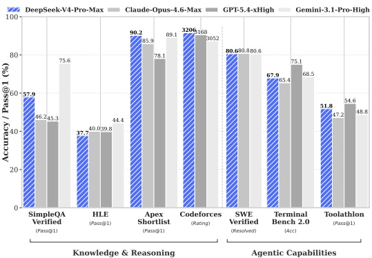
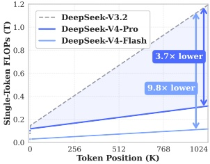
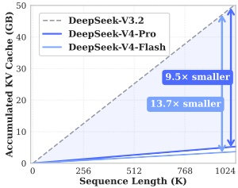

# DeepSeek-V4:

# Towards Highly Efficient Million-Token Context Intelligence

DeepSeek-AI

research@deepseek.com

## Abstract

We present a preview version of DeepSeek-V4 series, including two strong Mixture-of-Experts (MoE) language models — DeepSeek-V4-Pro with 1.6T parameters (49B activated) and DeepSeek-V4-Flash with 284B parameters (13B activated) — both supporting a context length of one million tokens. DeepSeek-V4 series incorporate several key upgrades in architecture and optimization: (1) a hybrid attention architecture that combines Compressed Sparse Attention (CSA) and Heavily Compressed Attention (HCA) to improve long-context efficiency; (2) Manifold-Constrained Hyper-Connections (mHC) that enhance conventional residual connections; (3) and the Muon optimizer for faster convergence and greater training stability. We pre-train both models on more than 32T diverse and high-quality tokens, followed by a comprehensive post-training pipeline that unlocks and further enhances their capabilities. DeepSeek-V4-Pro Max, the maximum reasoning effort mode of DeepSeek-V4-Pro, redefines the state-of-the-art for open models, outperforming its predecessors in core tasks. Meanwhile, DeepSeek-V4 series are highly efficient in long-context scenarios. In the one-million-token context setting, DeepSeek-V4-Pro requires only 27% of single-token inference FLOPs and 10% of KV cache compared with DeepSeek-V3.2. This enables us to routinely support one-million-token contexts, thereby making long-horizon tasks and further test-time scaling more feasible. The model checkpoints are available at https://huggingface.co/collections/deepseek-ai/deepseek-v4.

Figure 1 | Left: benchmark performance of DeepSeek-V4-Pro-Max and its counterparts. Right: inference FLOPs and KV cache size of DeepSeek-V4 series and DeepSeek-V3.2.

