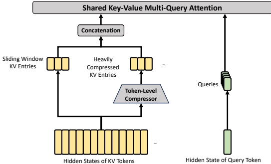

Figure 4 | Core architectures of HCA. It performs heavier compression, where the KV entries of  $ m' $ ( $ \gg $ m) tokens will be consolidated into one. Also, we additionally introduce a small set of sliding window KV entries to enhance local fine-grained dependencies.

Shared Key-Value MQA. After selecting the sparse KV entries, CSA then performs core attention in a Multi-Query Attention (MQA) (Shazeer, 2019) manner, where each compressed KV entry in  $ C_t^{SprsComp} $ serves as both attention key and value. To be specific, for a query token t, we first produce attention queries  $ \{q_{t,1}; q_{t,2}; \ldots; q_{t,n_h}\} $ from the compressed latent vector  $ \mathbf{c}_t^Q $:

 $$ [\mathbf{q}_{t,1};\mathbf{q}_{t,2};...;\mathbf{q}_{t,n_{h}}]=\mathbf{q}_{t}=\mathbf{c}_{t}^{Q}\cdot W^{U Q}, $$ 

where  $ n_h $ denotes the number of query heads;  $ W^{UQ} \in \mathbb{R}^{d_c \times cn_h} $ is the up-projection matrices for queries. Note that the latent query vector  $ \mathbf{c}_t^Q $ is shared with that used for the indexer queries. Next, we perform MQA on  $ \{\mathbf{q}_{t,i}\} $ and  $ C_t^{SprsComp} $:

 $$ \mathbf{o}_{t,i}=CoreAttn\left(\mathbf{q u e r y}=\mathbf{q}_{t,i},\mathbf{k e y}=C_{t}^{S p r s C o m p},\mathbf{v a l u e}=C_{t}^{S p r s C o m p}\right), $$ 

where  $ \mathbf{0}_{t,i} \in \mathbb{R}^c $ is the core attention output of the  $ i $-th head at the  $ t $-th token; CoreAttn( $ \cdot $) denotes the core attention operation.

Grouped Output Projection. In the configuration of DeepSeek-V4,  $ cn_h $ is quite large. Therefore, directly projecting the outputs of the core attention operation  $ [\mathbf{o}_{t,1}; \mathbf{o}_{t,2}; \ldots; \mathbf{o}_{t,nh}] = \mathbf{o}_t \in \mathbb{R}^{cn_h} $ to a  $ d $-dimensional hidden state will impose a substantial computational burden. To mitigate this cost, we design a grouped output projection strategy. To be specific, we first split  $ n_h $ outputs into  $ g $ groups, and then for each group of output  $ \mathbf{o}_{t,i}^G \in \mathbb{R}^{c^{\frac{n_h}{g}}} $, we project it to a  $ d_g $-dimensional intermediate output  $ \mathbf{o}_{t,i}^G' \in \mathbb{R}^d_g $, where  $ d_g < c^{\frac{n_h}{g}} $. Finally, we project the intermediate output  $ [\mathbf{o}_{t,1}^G'; \mathbf{o}_{t,2}^G'; \ldots; \mathbf{o}_{t,gh}^G'] \in \mathbb{R}^{d_g^g} $ to the final attention output  $ \hat{\mathbf{o}}_t \in \mathbb{R}^d $.

##### 2.3.2. Heavily Compressed Attention

The core architecture of HCA is illustrated in Figure 4, which compresses the KV cache in a heavier manner, but does not employ sparse attention.

Compressed Key-Value Entries. By and large, the compression strategy of HCA is similar to that of CSA, but employs a larger compression rate  $ m' $ ( $ \gg m $) and does not perform overlapped