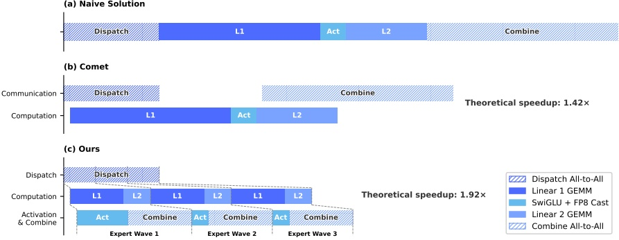

### 3. General Infrastructures

#### 3.1. Fine-Grained Communication-Computation Overlap in Expert Parallelism

Mixture-of-Experts (MoE) can be accelerated via Expert Parallelism (EP). However, EP requires complex inter-node communication and imposes substantial demands on interconnect bandwidth and latency. To alleviate the communication bottleneck in EP and achieve higher end-to-end performance under lower interconnection bandwidth requirements, we propose a fine-grained EP scheme that fuses communication and computation into a single pipelined kernel for communication-computation overlapping.

Communication Latency Can Be Hidden. The key insight of our EP scheme is that the communication latency can be effectively hidden beneath computation in MoE layers. As shown in Figure 5, in DeepSeek-V4 series, each MoE layer can be decomposed mainly into four stages: two communication-bound stages,  $ \underline{\text{Dispatch}} $ and  $ \underline{\text{Combine}} $, and two computation-bound stages,  $ \underline{\text{Linear-1}} $ and  $ \underline{\text{Linear-2}} $. Our profiling reveals that within a single MoE layer, the total time of communication is less than that of the computation. Therefore, after fusing communication and computation into a unified pipeline, computation remains the dominant bottleneck, implying that the system can tolerate lower interconnect bandwidth without degrading end-to-end performance.

Figure 5 | Illustration of our EP scheme with related works. Comet (Zhang et al., 2025b) overlaps Dispatch with Linear-1, and Linear-2 with Combine, separately. Our EP scheme achieves a finer-grained overlapping by splitting and scheduling experts into waves. The theoretical speedup is evaluated in the configuration of the DeepSeek-V4-Flash architecture.

Fine-Grained EP Scheme. To further lower the interconnect bandwidth requirement and amplify the benefits of overlapping, we introduce a finer-grained expert partitioning scheme. Inspired by many related works (Aimuyo et al., 2025; Zhang et al., 2025b), we split and schedule the experts into waves. Each wave consists of a small portion of experts. As soon as all experts within the wave have completed their communication, computation can commence immediately without waiting for other experts. In steady state, computation of current wave, token transfer for the next wave, and result sending of completed experts all proceed concurrently, as demonstrated in Figure 5. This forms a fine-grained pipeline among experts, keeping both computation and communication continuous throughout the wave. The wave-based scheduling speeds up the