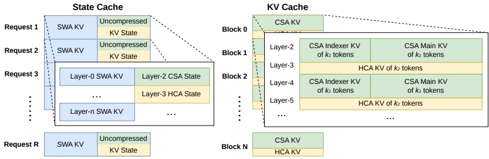

Figure 6 | Illustration of the KV cache Layout for DeepSeek-V4. The KV cache is organized into two primary components: a classical KV cache for CSA/HCA, and a state cache for SWA and unready-for-compression tokens in CSA/HCA. In the state cache, each request is assigned a fixed-size cache block. Within this block, the SWA segment stores the KV entries corresponding to the most recent  $ n_{\text{win}} $ tokens, while the CSA/HCA segment stores uncompressed tail states that are not yet ready for compression. In the classical KV cache, we allocate multiple blocks per request. Each cache block covers  $ \text{lcm}(m, m') $ original tokens, producing  $ k_1 = \frac{\text{lcm}(m, m')}{m} $ CSA compressed tokens and  $ k_2 = \frac{\text{lcm}(m, m')}{m'} $ HCA compressed tokens.

into the KV cache that possess embedding sizes distinct from those in the primary attention. The compression techniques employed in CSA and HCA reduce the sequence length by factors of  $ \frac{1}{m} $ and  $ \frac{1}{m} $, respectively, thereby decreasing the overall KV cache size. As a result, KV cache sizes vary across different layers. Furthermore, Sliding Window Attention (SWA) layers also operate with distinct KV cache sizes, as well as separate cache hit and eviction policies. In the compression branch, one KV entry is generated for every m tokens. When the number of remaining tokens is insufficient for compression, all pending tokens and their associated hidden states must be retained in a buffer until the compression operation can be executed. These buffered tokens represent a sequence state determined by positional context and are also managed within the KV cache framework.

Challenges in Managing Hybrid Attention KV Cache. The hybrid attention mechanism violates fundamental assumptions behind PagedAttention and its variants. Although recent hybrid KV cache managing algorithms (e.g., Jenga (Zhang et al., 2025a), Hymba (Dong et al., 2025)) target general hybrid attention models or specific structures, two principal obstacles prevent consolidating KV caches across all layers under the PagedAttention framework:

• Diverse cache policies, such as those used in Sliding Window Attention.

• Constraints imposed by high-performance attention kernels, including alignment requirements.

For efficient KV cache management of DeepSeek-V4, we design corresponding strategies to overcome these two challenges.

State Cache for SWA and Uncompressed Tail Tokens. To address the first obstacle, we adopt an alternative cache management mechanism. Since SWA is designed to enhance performance under a limited KV cache size, it is reasonable to treat it, along with the uncompressed tail tokens from the compression branch, as a state-space model. The corresponding KV cache can thus be