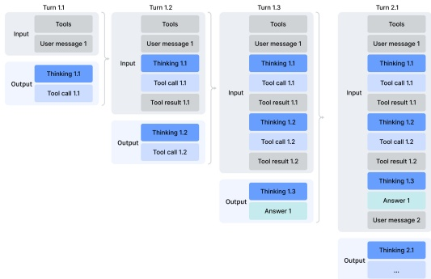
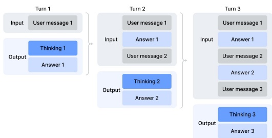

b) Thinking without tools

Figure 7 | Thinking management of DeepSeek-V4 series.

Interleaved Thinking. DeepSeek-V3.2 introduced a context management strategy that retains reasoning traces across tool-result rounds but discards them upon the arrival of new user messages. While effective, this still caused unnecessary token waste in complex agentic workflows — each new user turn would flush all accumulated reasoning content, forcing the model to reconstruct its problem-solving state from scratch. Leveraging the expanded 1M-token context window of DeepSeek-V4 series, we further refine this mechanism to maximize the effectiveness of interleaved thinking in agentic environments:

• Tool-Calling Scenarios. As illustrated in Figure 7(a), all reasoning content is fully preserved throughout the entire conversation. Unlike DeepSeek-V3.2, which discarded thinking traces upon each new user turn, DeepSeek-V4 series retain the complete reasoning history across all rounds, including across user message boundaries. This allows the model to maintain a coherent, cumulative chain of thought over long-horizon agent tasks.

- General Conversational Scenarios. As illustrated in Figure 7(b), the original strategy is preserved: reasoning content from previous turns is discarded when a new user message arrives, keeping the context concise for settings where persistent reasoning traces provide limited benefit.

As with DeepSeek-V3.2, agent frameworks that simulate tool interactions via user messages (e.g., Terminus) may not trigger the tool-calling context path and thus may not benefit from enhanced