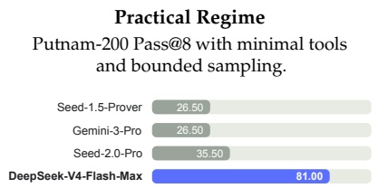
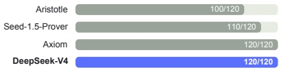
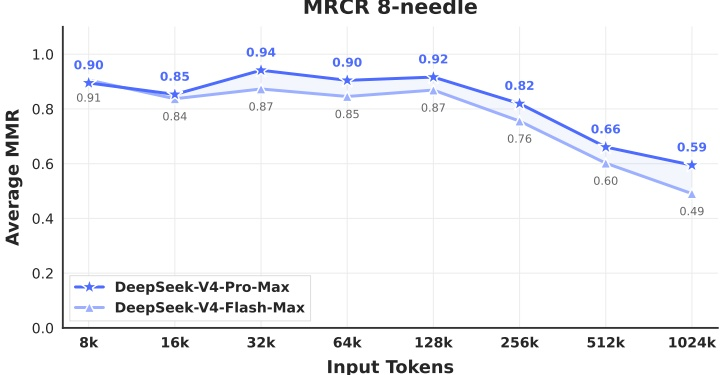

Frontier Regime

Putnam-2025 with hybrid formal-informal reasoning and substantial compute scaling.

Figure 8 | Formal reasoning under practical and frontier regimes. Left: Putnam-200 Pass@8 evaluates a fixed random subset of PutnamBench (Tsoukalas et al., 2024) following the setup introduced by Seed-Prover; all models are tested on the same problem set. We follow the Seed-Prover protocol but replace proprietary search tools with the open-source LeanExplore (Asher, 2025), yielding a lightweight setting with minimal agent tools and bounded sampling. Right: Putnam-2025 probes the frontier of mathematical reasoning in a scaled hybrid formal-informal regime, where informal reasoning is combined with formal verification to expose gaps and improve rigor; DeepSeek-V4 reaches a proof-perfect 120/120.

Figure 9 | DeepSeek-V4 series performance on the MRCR task.

degradation becomes visible beyond the 128K mark, the model’s retrieval capabilities at 1M tokens remain remarkably strong compared to both proprietary and open-source counterparts. Unlike MRCR, CorpusQA is similar to real scenarios. The evaluation results also indicate that DeepSeek-V4-Pro is better than Gemini-3.1-Pro.

Reasoning Effort. As shown in Table 7, the Max mode, which employs longer contexts and reduced length penalties in RL, outperforms the High mode on the most challenging tasks. Figure 10 presents a comparison of performance and cost among DeepSeek-V4-Pro, DeepSeek-V4-Flash, and DeepSeek-V3.2 on representative reasoning and agentic tasks. By scaling test-time compute, DeepSeek-V4 series achieve substantial improvements over the predecessor. Furthermore, on reasoning tasks like HLE, DeepSeek-V4-Pro demonstrates higher token efficiency than DeepSeek-V3.2.