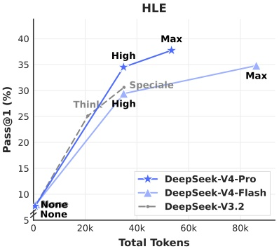
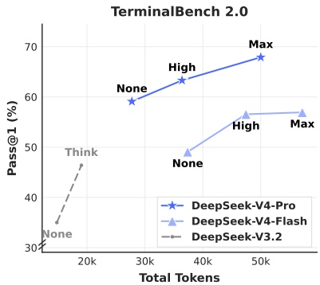

Figure 10 | HLE and Terminal Bench 2.0 performance by reasoning effort. “None” indicates Non-think mode, and “Speciale” indicates DeepSeek-V3.2-Speciale model.

#### 5.4. Performance on Real-World Tasks

Standardized benchmarks often struggle to capture the complexities of diverse, real-world tasks, creating a gap between test results and actual user experience. To bridge this, we have developed proprietary internal metrics that prioritize real-world usage patterns over traditional benchmarks. This approach ensures that our optimizations translate into tangible benefits. Our evaluation framework specifically targets the primary use cases of the DeepSeek API and Chatbot, aligning model performance with practical demands.

##### 5.4.1. Chinese Writing

One of the primary use cases for DeepSeek is Chinese writing. We conducted a rigorous evaluation on functional writing and creative writing. Table 12 presents a pairwise comparison between DeepSeek-V4-Pro and Gemini-3.1-Pro on functional writing tasks. These tasks consist of common daily writing queries, where prompts are typically concise and straightforward. Gemini-3.1-Pro was selected as the baseline, as it stands as the top-performing external model for Chinese writing in our evaluations. The results indicate that DeepSeek-V4-Pro outperforms the baseline with an overall win rate of 62.7% versus 34.1%; this is primarily because Gemini occasionally allows its inherent stylistic preferences to override the user's explicit requirements in Chinese writing scenarios.

Table 13 presents the creative writing comparison, which is evaluated along two axes: instruction following and writing quality. Compared with Gemini-3.1-Pro, DeepSeek-V4-Pro achieves a 60.0% win rate in instruction following and 77.5% in writing quality, demonstrating a marginal improvement in instruction following and a substantial gain in writing quality. Although DeepSeek-V4-Pro yields superior results in aggregate user case analysis, an evaluation restricted to the most challenging prompts — specifically those involving high-complexity constraints or multi-turn scenarios — reveals that Claude Opus 4.5 retains a performance advantage over DeepSeek-V4-Pro. As shown in Table 14, Claude Opus 4.5 achieves a 52.0% win rate versus 45.9%.