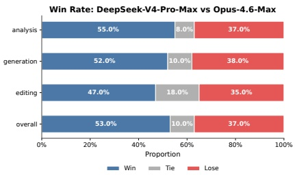
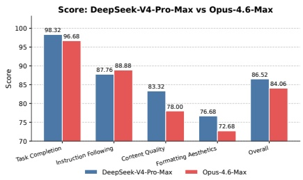
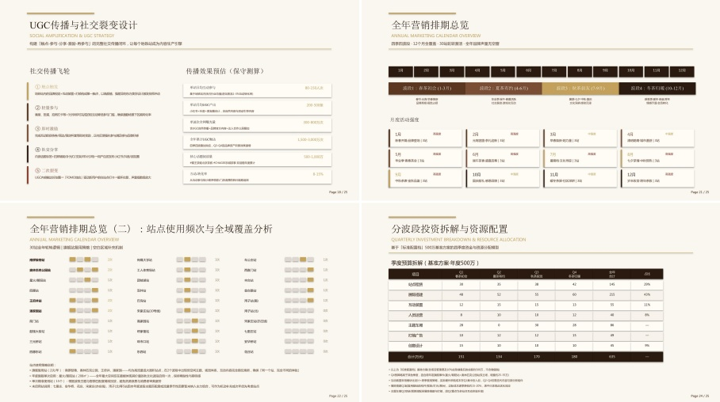

Content Quality. Specifically, DeepSeek-V4-Pro-Max proactively anticipates implicit user intents by frequently providing supplementary insights and self-verification steps. It also excels in long-form generation, delivering in-depth, coherent narratives rather than relying on the overly simplistic bullet points frequently produced by Opus-4.6-Max. Additionally, the model strictly conforms to formal professional conventions, such as standardized Chinese hierarchical numbering. However, in terms of Instruction Following, it occasionally overlooks specific formatting constraints and slightly trails Opus. Furthermore, the model is less proficient at condensing extensive text inputs into succinct summaries. Finally, its Formatting Aesthetics still have substantial room for improvement regarding the overall visual design of presentation slides. Figure 13, 14, and 15 present several test cases; due to the extensive length of certain outputs, only partial pages are displayed.

Figure 11 | Win-rate comparison across analysis, generation, editing tasks, and the overall performance.

Figure 12 | Detailed dimension scores including Task Completion, Content Quality, Formatting Aesthetics, and Instruction Following.

Figure 13 | Example output of a task which requires drafting a joint marketing proposal for a popular bubble tea brand and the Beijing Subway.

