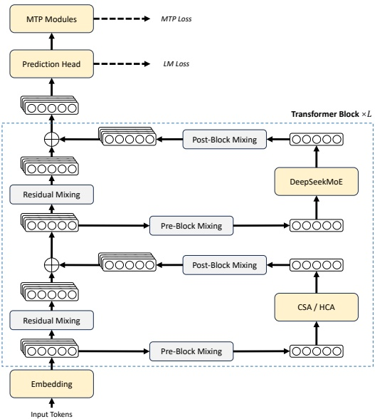

Figure 2 | Overall architecture of DeepSeek-V4 series. We use hybrid CSA (Compressed Sparse Attention) and HCA (Heavily Compressed Attention) for attention layers, DeepSeekMoE for feed-forward layers, and strengthen conventional residual connections with mHC.

performance to GPT-5.2 and Gemini-3.0-Pro, establishing itself as a highly cost-effective architecture for complex reasoning tasks.

• Agent: On public benchmarks, DeepSeek-V4-Pro-Max is on par with leading open-source models, such as Kimi-K2.6 and GLM-5.1, but slightly worse than frontier closed models. In our internal evaluation, DeepSeek-V4-Pro-Max outperforms Claude Sonnet 4.5 and approaches the level of Opus 4.5.

• Long-Context: DeepSeek-V4-Pro-Max delivers strong results on synthetic and real use cases with a 1-million-token context window, surpassing even Gemini-3.1-Pro on academic benchmarks.

• DeepSeek-V4-Pro v.s. DeepSeek-V4-Flash: DeepSeek-V4-Flash-Max exhibits lower performance in knowledge evaluations due to its smaller parameter scale. However, it achieves comparable results on reasoning tasks when allocated a larger thinking budget. In agent evaluations, while DeepSeek-V4-Flash-Max matches the performance of DeepSeek-V4-Pro-Max on several benchmarks, it still trails its larger counterpart on more complex, high-difficulty tasks.

### 2. Architecture

Overall, DeepSeek-V4 series retain the Transformer (Vaswani et al., 2017) architecture and Multi-Token Prediction (MTP) modules (DeepSeek-AI, 2024; Gloeckle et al., 2024), while introducing several key upgrades over DeepSeek-V3: (1) firstly, we introduce the Manifold-Constrained Hyper-Connections (mHC) (Xie et al., 2026) to strengthen conventional residual connections;