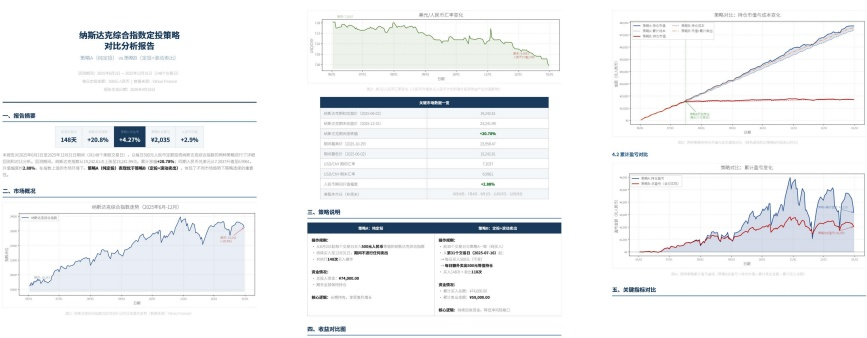
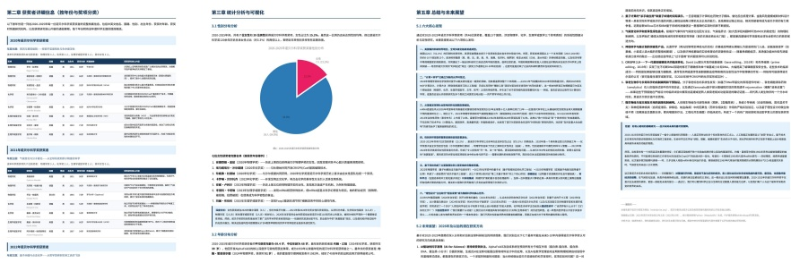

Figure 14 | Example output of a task that requires comparing two regular investment strategies for the NASDAQ.

Figure 15 | Example output of a task which requires researching 2020-2025 Nobel Science Prizes and generating an analytical PDF report.

