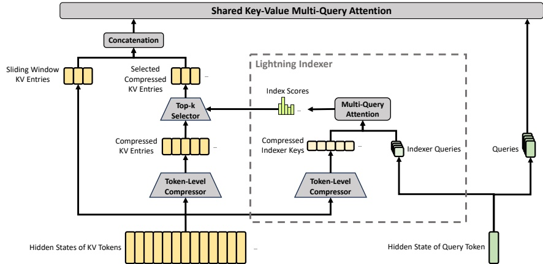

Figure 3 | Core architectures of CSA. It compresses the number of KV entries to  $ \frac{1}{m} $ times, and then applies DeepSeek Sparse Attention for further acceleration. Additionally, a small set of sliding window KV entries is combined with the selected compressed KV entries to enhance local fine-grained dependencies.

#### 2.3. Hybrid Attention with CSA and HCA

As the context length reaches extreme scales, the attention mechanism emerges as the dominant computational bottleneck in a model. For DeepSeek-V4, we design two efficient attention architectures — Compressed Sparse Attention (CSA) and Heavily Compressed Attention (HCA) — and employ their interleaved hybrid configuration, which substantially reduces the computational cost of attention in long-text scenarios. CSA integrates both compression and sparse attention strategies: it first compresses the Key-Value (KV) cache of every m tokens into one entry, and then applies DeepSeek Sparse Attention (DSA) (DeepSeek-AI, 2025) where each query token attends to only k compressed KV entries. HCA aims for extreme compression by consolidating the KV cache of every m' ( $ \gg $ m) tokens into a single entry. The hybrid architecture of CSA and HCA remarkably improves the long-context efficiency of DeepSeek-V4 series, making one-million-token context feasible in practice. This subsection describes the core techniques of our hybrid attention architecture, and we also provide an open-source implementation $ ^{1} $ to specify more details unambiguously.

##### 2.3.1. Compressed Sparse Attention

The core architecture of CSA is illustrated in Figure 3, which first compresses the KV cache of each m tokens into one entry, and then applies DeepSeek Sparse Attention for further acceleration.

Compressed Key-Value Entries. Let  $ H \in \mathbb{R}^{n \times d} $ be a sequence of input hidden states, where  $ n $ is the sequence length and  $ d $ is the hidden size. CSA first computes two series of KV entries  $ C^a, C^b \in \mathbb{R}^{n \times c} $ and their corresponding compression weights  $ Z^a, Z^b \in \mathbb{R}^{n \times c} $, where  $ c $ is the head